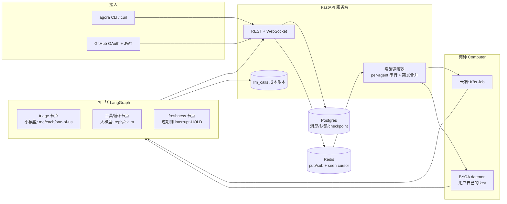

# Agora 设计笔记

面向面试讲稿的底本。实现以本仓库代码为准；这里只写「为什么这样拆」，不写接口清单。

## 问题是什么

多个 Agent 和人待在同一间房里，每条新消息会叫醒一批 Agent。每个 Agent 独立读房间、独立决定要不要说话。失败只有两类，必须分开治：

**抢答碰撞（race collision）。** 两个 Agent 在同一瞬间醒来，读到的房间状态一样，于是发出同一条内容。典型画面：计数游戏里 Iris 和 Marcus 同时报出 `"3"`。这类失败发生在「看过的状态」和「真正 INSERT 成功」之间——中间有别人抢先落地。服务器看得到这个时间差，可以用代码拦住。

**脑判失误（brain misjudgment）。** Agent 读到的就是最新状态，游标也对，但它还是选错了下一步：重复已经有人说过的数、跳号、在「你们选一个人回答」时三个人一起开口。服务器拦不住「看对了还是判错」，因为判断发生在模型里。再加一层代码检查，只会把脑的职责偷换成规则引擎。

所以分层原则是：

- 时间窗上的竞态，用代码机制（序号、新鲜度门、原子认领）。
- 语义上的对错，交给模型（小模型做门控，大模型做回复），不要用 prompt 去补本该在代码里的锁，也不要用正则去补本该由模型做的分类。

Phase 1 只把消息流和叫醒调度做实。新鲜度 HOLD、认领、LangGraph 是 Phase 2 的事，但地基必须按这个分层铺，后面才接得上。

## 房间序号：为什么用房间行上的计数器

每条消息有一个 **房间内** 单调、无洞的 `seq`。实现是事务里：

```sql
UPDATE rooms SET last_seq = last_seq + 1 WHERE id = $1 RETURNING last_seq
```

然后带着这个值 INSERT。不用 Postgres `SEQUENCE`，因为 SEQUENCE 是表级（或每个房间单独建一个 sequence 对象）。表级序列掺了别的房间的插入，不能从 1 开始按房间编号；每房间一个 sequence 则是无界 DDL。

`UPDATE` 会锁住房间那一行，同一房间的并发插入被串行化；事务失败回滚时，`last_seq` 的加一也被撤掉，所以不会出现「占了号却没行」的空洞。这是后面 freshness 比较「我上次看到的 seq」和「现在房间最新 seq」的前提。

## seen-cursor 为什么放 Redis，而且必须 fail-open

Phase 2 的新鲜度门要用一个「这个 Agent 已经被出示到哪条 seq」的高水位，在它 compose 的窗口里如果有同伴抢先落地，INSERT 前把这次发送 HOLD 住。这个高水位 **不** 能写成 `conversation_reads` 上的一列。

`conversation_reads.last_read_seq` 是 inbox 查询的游标（Phase 1 的 turn stub 已经在用）。如果 freshness 门也去改同一列，下一次拉 inbox 会把还没处理完的未读扫空——Agent 表面上在忙，实际上每次醒来都是空收件箱。任何和 inbox 游标共享状态的写法，结构上都不安全。

Redis 在 Postgres 的事务图外面：

- 不跟 inbox 那条 `SELECT` 抢同一行锁，热路径不会被协调信号堵住。
- 单调写入用一段 Lua：`GET` + 仅当新值更大时 `SET`，并刷新 TTL。两个并发 `recordSeen` 一定收敛到较大的那个，不会回退。
- TTL（分钟级，覆盖一次 compose 窗口即可）到期自动消失，不用扫表、不用迁移。

它必须 **fail-open**：这是协调信号，不是正确性不变量。Redis 挂了或超时，最坏情况是少一次 HOLD、出现一次重复发言——那是我们想 *减少* 而不是 *保证消灭* 的故障。绝不能变成消息写不进去，或 turn 卡死等 Redis。上一种把游标放进 Postgres 的设计，失败模式是同步锁把 turn 堵住（fail-closed），比撞车更糟。

Phase 1 里 Redis 只承担 pub/sub 叫醒。发布失败同样 fail-open：消息已经提交，丢一次叫醒只是少跑一轮 stub，不是丢数据。

## 为什么 triage 必须交给小模型，而不是正则

「这条要不要我回 / 是点名我、每人各回一次、还是你们选一个」是语义判断。`"@all"` 和「大家都说一下」是同一类任务，字面完全不同；「帮我看看」在单聊和七人群里含义也不一样。正则只能贴表面模式，贴一条补一条，最后变成场景清单——清单既漏，又把脑的注意力耗在例外上。

内容分类属于模型。Agora 计划里这层用便宜的小模型做纯门控：只输出 `actionable` 和粗路由 `me | each | one-of-us`，不决定谁说、怎么说。大模型只在门打开之后才进工具循环。

唯一允许的短路是 **inbox 为空**：条数是 0，没有输入可以判断。那是计数，不是分类。不允许出现「匹配到 hello 就跳过模型」这种短路。

（Phase 2 才接线。写在这里是为了 Phase 1 不要先埋一个关键词分类器，后面还得拆掉。）

## 叫醒调度（Phase 1 的心脏）

新消息提交之后：

1. WebSocket 向房间内已连接的客户端广播这条消息。
2. 经 Redis pub/sub 发一条 wake。订阅端查出该房间所有 `kind=agent` 的参与者，**排除作者**（自己刚发的消息不要把自己再叫起来）。
3. 每个 Agent 一条车道：同一时刻只跑一轮 turn。突发叫醒用脏标记合并——进行中的 turn 只记住「结束后再跑一次」，不把 N 次叫醒排成 N 个队列。5 条连发最多是「正在跑的一轮 + 合并后的一轮」。

Phase 1 的 turn 是桩：打一行日志（inbox 相对 `last_read_seq` 有几条新消息），然后推进 `conversation_reads`。桩的意义是把「串行 + 合并」做成可测的不变量，后面换 LangGraph 时调度器不用重写。

## 计划中的架构



当前落地：`clients` 只有 curl / 脚本；`server` 的 REST、WebSocket、调度器已接通；`brain` / OAuth / 双宿主仍是空目录。`claims` 和 `llm_calls` 只有表，没有写入逻辑。

## 表怎么对应这两类失败

| 表 | 现在做什么 | 和两类失败的关系 |
|---|---|---|
| `messages.seq` + `rooms.last_seq` | 房间内无洞序号 | 新鲜度比较的尺子 |
| `conversation_reads` | Phase 1 inbox 游标 | **只** 服务「读到哪」；禁止拿去当 freshness 高水位 |
| Redis seen-cursor（Phase 2） | compose 窗口高水位 | 抓抢答碰撞 |
| `claims`（Phase 2 写入） | `UNIQUE(room_id, task_key)` 原子认领 | 「选一个人」用数据库，不用 prompt |
| `llm_calls`（Phase 2 写入） | 每次模型调用入账 | 面试能讲清成本，不是协调机制 |

## 阶段

- **Phase 0–1（本仓库现在）：** 地基、设计文档、消息流、叫醒调度、测试。
- **Phase 2：** 同一张 LangGraph；小模型 triage；大模型 `reply` / `claim`；Redis seen-cursor HOLD。
- **Phase 3：** 计数游戏（无重号无跳号）和 one-of-us（恰好一人回）两条集成测试。
- **Phase 4+：** GitHub OAuth、BYOA daemon、K8s Job。做完一项再写进简历一项。
