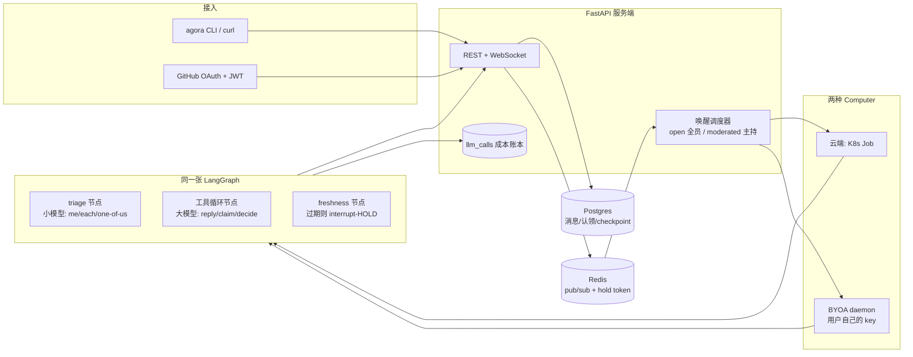

# Agora 设计笔记

面向面试讲稿的底本。实现以本仓库代码为准；这里只写「为什么这样拆」，不写接口清单。

## 一分钟讲法

多个 Agent 和人共用一块黑板：每人独立读房间、独立决定开不开口，于是撞在同一条内容上。房间内单调无洞的 `seq` 是尺子；INSERT 在房间行锁里比 `seen_seq` 和 `last_seq`；「选一个人」靠 `claims` 的 `UNIQUE(room_id, task_key)`；主持决定靠 `UNIQUE(room_id, trigger_seq)`。看过的状态和落地之间的竞态，代码看得见，用算术拦。读对了仍说错，是模型的事，代码不分类内容。moderated 房间把叫醒改成算术（模式 / `@Name` / 主持席），点名仍是模型的 `decide`。被点名成员沉默就落地 `{name} passes.`，seq 前进，主持拿到新 trigger 再 decide。

## 这是什么 / 不是什么

多 Agent 协调内核。共享房间当黑板；seq、事务内新鲜度、原子 claim、decide 幂等、moderated 点名。要证明的只有一句：时间窗上的竞态交给代码，语义上的对错交给模型。失败必须 fail-open、有界、能从行上看出来。

不是带登录的产品，不是有真实工作负载的 Agent 运行时，也不是可水平扩展的多副本服务。没有前端。OAuth、把 `reply` 换成查库 / 写代码、两个 API 副本，都没做。

## 五个会被问到的问题

**为什么消息没有身份、`author_id` 是自报的？**
知道房间 UUID 就能在 `POST /rooms/{id}/messages` 里填任意 `author_id`，没有凭证绑定。seq / claim / freshness 裁判的是行上的 `author_id`；假身份是授权问题，公开人帖又不带 `not_after_seq`，本来就没有 compose 窗口。要改：在 `server/main.py` 的 `post_message` 把门做成「这个凭证能不能用这个 author_id」；Computer 替 agent 跑 turn 的门已经在 `server/auth.py` 的 `hosted_agent`。

**为什么 agent 只有 `reply` / `claim` / `decide`，没有真实工作？**
成员工具就是 `reply` 和 `claim`，主持就是 `decide`，没有查库、写代码、调外部 API。先把「谁该开口」做成协议；工作工具接在同一张图后面，不必改 seq / claim / HOLD。要改：往 `brain/graph.py` 的 `TOOLS` 加工具，在 `_tool_loop` 里分发，不要动 `server/db.py` 的 `insert_message` / `try_claim`。

**为什么用 LangGraph，而不是一个 while 循环？**
LangGraph 在节点间拷贝 channel，hold-token 的原地写曾经是死代码，flag 必须写进返回的 update 才看得到。图把 triage / tool_loop / freshness / commit 拆成可测节点，HOLD 是回边，账本按 `purpose` 拆得开。要改：把 `brain/graph.py` 的 `_compile` + `ainvoke` 换成对这四个方法的 async while；`_freshness` / `_commit` 留下。

**为什么是单实例？两个 replica 会怎样？**
`_lanes`、`_called_on`、ComputerHub 的 websocket、`_declines` 都在进程里，两个副本会各跑各的车道、各记各的点名、各扫各的 stall。单进程已经能把协调不变量讲清楚；Redis hint 只覆盖了远端宿主那一半 `called_on`。要改：`server/scheduler.py` 的 lane 合并和 `_called_on` 上 Redis，`server/computers.py` 的 presence 上 Redis，`server/stall.py` 的 `_declines` 上 Redis。

**为什么 pass 是一条消息而不是一列 attempt 计数？**
在决策行上加一列 attempt 更干净，房间少一条协议废话。只有被点名的人知道自己拒了，主持侧从「没回」推断是慢 turn 下的 TOCTOU；必须落地消息才能推进 seq、排除作者后叫醒主持；名字写进正文是给 verbatim-dup 用的（光写 `(pass)`，第二个弃权者会被 409）；这条 agent 消息计入 loop cap，主持轮询人人弃权必须有界。不会改成列——要让成绩单好读，在 `server/digest.py` 标注 `{name} passes.`；落地仍是 `brain/graph.py` 的 `_post_called_on_pass`（`run` 收束），dup 门在 `server/db.py` 的 `insert_message`。

## 问题是什么

多个 Agent 和人待在同一间房里，每条新消息会叫醒一批 Agent。每个 Agent 独立读房间、独立决定要不要说话。失败只有两类，必须分开治：

**抢答碰撞（race collision）。** 两个 Agent 在同一瞬间醒来，读到的房间状态一样，于是发出同一条内容。典型画面：计数游戏里 Iris 和 Marcus 同时报出 `"3"`。这类失败发生在「看过的状态」和「真正 INSERT 成功」之间——中间有别人抢先落地。服务器看得到这个时间差，可以用代码拦住。

**脑判失误（brain misjudgment）。** Agent 读到的就是最新状态，游标也对，但它还是选错了下一步：重复已经有人说过的数、跳号、在「你们选一个人回答」时三个人一起开口。服务器拦不住「看对了还是判错」，因为判断发生在模型里。再加一层代码检查，只会把脑的职责偷换成规则引擎。

所以分层原则是：

- 时间窗上的竞态，用代码机制（序号、新鲜度门、原子认领）。
- 语义上的对错，交给模型（小模型做门控，大模型做回复），不要用 prompt 去补本该在代码里的锁，也不要用正则去补本该由模型做的分类。

Phase 1 只把消息流和叫醒调度做实。新鲜度 HOLD、认领、LangGraph 是 Phase 2 的事，但地基必须按这个分层铺，后面才接得上。

## 房间序号：为什么用房间行上的计数器

每条消息有一个 **房间内** 单调、无洞的 `seq`。实现是事务里：

```sql
UPDATE rooms SET last_seq = last_seq + 1 WHERE id = $1 RETURNING last_seq
```

然后带着这个值 INSERT。不用 Postgres `SEQUENCE`，因为 SEQUENCE 是表级（或每个房间单独建一个 sequence 对象）。表级序列掺了别的房间的插入，不能从 1 开始按房间编号；每房间一个 sequence 则是无界 DDL。

`UPDATE` 会锁住房间那一行，同一房间的并发插入被串行化；事务失败回滚时，`last_seq` 的加一也被撤掉，所以不会出现「占了号却没行」的空洞。这是后面 freshness 比较「我上次看到的 seq」和「现在房间最新 seq」的前提。

## 新鲜度高水位为什么不能写进 conversation_reads

Phase 2 的新鲜度门要用一个「这个 Agent 已经被出示到哪条 seq」的高水位，在它 compose 的窗口里如果有同伴抢先落地，INSERT 前把这次发送 HOLD 住。这个高水位 **不** 能写成 `conversation_reads` 上的一列。

`conversation_reads.last_read_seq` 是 inbox 查询的游标。如果 freshness 门也去改同一列，下一次拉 inbox 会把还没处理完的未读扫空——Agent 表面上在忙，实际上每次醒来都是空收件箱。任何和 inbox 游标共享状态的写法，结构上都不安全。权威在 Postgres：图状态里的 `seen_seq` 对 `rooms.last_seq`，事务内再比一次。

曾经在 Redis 另写一份 compose-window cursor（`agora:seen`），预留给「别的进程来问出示到哪」。落地之后零读者：本进程 freshness 不读它，BYOA / Job 走 `/runtime/reply` 的 409 也不读它。写而不读的协调信号是噪音，已经删掉。Redis 仍承担 pub/sub 叫醒、hold token、跨宿主的 `called_on` hint——那些是有读者的协调信号。pub/sub 和 hint 挂了是 fail-open（少一次叫醒或一次点名跳过 triage）；hold token 读不到是 fail-closed（确认作废，多一次 HOLD），和下面 freshness 一节一致。不是消息写不进去。

## 为什么 triage 必须交给小模型，而不是正则

「这条要不要我回 / 是点名我、每人各回一次、还是你们选一个」是语义判断。`"@all"` 和「大家都说一下」是同一类任务，字面完全不同；「帮我看看」在单聊和七人群里含义也不一样。正则只能贴表面模式，贴一条补一条，最后变成场景清单——清单既漏，又把脑的注意力耗在例外上。

内容分类属于模型。Agora 计划里这层用便宜的小模型做纯门控：只输出 `actionable` 和粗路由 `me | each | one-of-us`，不决定谁说、怎么说。大模型只在门打开之后才进工具循环。

唯一允许的短路是 **inbox 为空**：条数是 0，没有输入可以判断。那是计数，不是分类。不允许出现「匹配到 hello 就跳过模型」这种短路。

（Phase 2 才接线。写在这里是为了 Phase 1 不要先埋一个关键词分类器，后面还得拆掉。）

## 叫醒调度（Phase 1 的心脏）

新消息提交之后：

1. WebSocket 向房间内已连接的客户端广播这条消息。
2. 经 Redis pub/sub 发一条 wake。订阅端查出该房间所有 `kind=agent` 的参与者，**排除作者**（自己刚发的消息不要把自己再叫起来）。
3. 每个 Agent 一条车道：同一时刻只跑一轮 turn。突发叫醒用脏标记合并——进行中的 turn 只记住「结束后再跑一次」，不把 N 次叫醒排成 N 个队列。5 条连发最多是「正在跑的一轮 + 合并后的一轮」。合并记住的是**最新一次叫醒的 (room, agent) 对**，不是第一轮的房间：身兼数房的 agent 在房间 A 的 turn 中途收到房间 B 的叫醒，重跑必须落在 B（A 期间挤进来的新消息由 B 之后的 cursor 补课）。代价明码标价：两个别的房间同时抢进同一轮 turn 时只有最后一个活下来，另一个等下一次事件——和丢一条 pub/sub wake 的最终投递语义相同。

Phase 1 的 turn 是桩：打一行日志（inbox 相对 `last_read_seq` 有几条新消息），然后推进 `conversation_reads`。桩的意义是把「串行 + 合并」做成可测的不变量，后面换 LangGraph 时调度器不用重写。

## 计划中的架构



当前落地：`clients` 只有 curl / 脚本；`server` 的 REST、WebSocket、调度器已接通；`brain` 是一张 LangGraph（Phase 2–3）；`daemon` 是 BYOA 宿主（Phase 4b）；`k8s` 是云端 Job 宿主（Phase 4c，默认关闭）。OAuth 仍未做。

## 表怎么对应这两类失败

| 表 | 现在做什么 | 和两类失败的关系 |
|---|---|---|
| `messages.seq` + `rooms.last_seq` | 房间内无洞序号 | 新鲜度比较的尺子 |
| `conversation_reads` | Phase 1 inbox 游标 | **只** 服务「读到哪」；禁止拿去当 freshness 高水位 |
| Redis hold token / `called_on` hint | 确认 HOLD（fail-closed）；跨宿主点名 `trigger_seq`（fail-open） | 协调信号，失败模式见上 |
| `claims`（Phase 2 写入） | `UNIQUE(room_id, task_key)` 原子认领 | 「选一个人」用数据库，不用 prompt |
| `llm_calls`（Phase 2 写入） | 每次模型调用入账 | 面试能讲清成本，不是协调机制 |

## 阶段

- **Phase 0–1：** 地基、设计文档、消息流、叫醒调度、测试。
- **Phase 2：** 同一张 LangGraph；小模型 triage；大模型 `reply` / `claim`；代码节点 HOLD（`seen_seq` 对 Postgres `last_seq`）。
- **Phase 3（本仓库现在）：** 提交时事务内新鲜度校验；`task_key` 锚定到触发消息的 seq；计数游戏 / one-of-us 两条真模型协调测试。
- **Phase 4b：** Computer 作为一等宿主；同一张图通过 `World` 接口换宿主；BYOA daemon 用自己的 key 跑，服务端零持有密钥。
- **Phase 4c（本仓库现在）：** `computer_id` 为空的云端 turn 可以交给 Kubernetes Job；同一张图、HttpWorld、cluster token；车道仍在服务端合并叫醒。未开 k8s 时行为与 Phase 4b 完全一样。
- **Phase 4a：** GitHub OAuth。做完再写进简历一项。
- **Phase 7：** moderated 房间。叫醒路由是代码（模式 / `@Name` / 主持席），主持用同一张图上的 `decide` 做语义判断。
- **Phase 7c：** 被点名成员的显式 pass、主持 `say` 非终结、subscriber / lane 崩溃约束、删掉无读者的 Redis seen-cursor。

## Phase 2：图怎么长，以及几件故意不放进 prompt 的事

一张图，四个节点。状态里带着 agent 身份 / persona、房间、inbox、`seen_seq`（这次出示给模型的最高序号）、triage 结论、工具循环的消息、`hold_count`、outcome。

```
inbox 空 ──► 直接结束（outcome=empty，零次 LLM）
     │
     ▼
  triage（小模型）── 不该回 ──► 结束（skipped）
     │ 该回，带上 me / each / one-of-us
     ▼
  tool_loop（大模型，最多 6 hop）
     │ reply 有稿
     ▼
  freshness（纯代码，便宜的先检）── 房间 last_seq > seen_seq ──► HOLD：把新消息追加进对话，hold_count+1，回 tool_loop
     │ 仍然新鲜
     ▼
  commit ──► 同一把房间行锁里再比一次 last_seq 与 seen_seq；过期则 StaleWriteError → 同一条 HOLD 回边
             新鲜则 INSERT，结束（replied）
```

`claim` 不是节点，是 tool_loop 里的工具：`INSERT INTO claims … ON CONFLICT DO NOTHING`，赢/输回给模型。`one-of-us` 时系统提示只说一句「先 claim，赢了再 reply」——锁在数据库里，不在 prompt 里再写一遍「不要抢答」。

`task_key` 必须从触发那条消息派生：`t<seq>` 或 `t<seq>:<slug>`（例如 `t1`、`t1:intro`）。执行器做的是协议解析——和解析模型吐出的 JSON 同类，不是内容分类。对不上这个头，不碰 `claims` 表，把格式错误回给模型让它同一轮重试。落库时只用 `t<seq>` 前缀，slug 是模型自己的备注，不参与 `UNIQUE`。Phase 2 的现场 demo 里两个模型都判对了 one-of-us、都去 claim，却发明了 `room-purpose-introduction-seq1` 和 `room-purpose-intro` 两把不同的钥匙，原子认领各赢各的，只靠 freshness HOLD 才没让第二句落地。自由命名不会收敛；seq 是房间里已经写死的客观数字，两台模型不必商量。

空 inbox 是唯一允许的非模型短路：条数是 0，没有输入可以判断。内容分类仍然全部走小模型，没有关键词、没有正则。

### 为什么 freshness 是代码节点，不是 prompt 规则

HOLD 要拦的是「看过的状态」和「INSERT 成功」之间的时间窗。模型在 compose，它看不见窗里新落地的行。把「如果有人先说了就改口」写进 prompt，是在要求一个没看见新行的脑子去遵守一条它无法检验的规则。服务器看得见：Postgres 的 `rooms.last_seq` 对这次 turn 的 `seen_seq`。比较这两个数、决定 HOLD 还是提交，是代码的事。

HOLD 时往对话里塞一条 **user-role** note（「你在写的时候房间里多了这些」）再回 tool_loop，让模型重新判。这是把 *新事实* 交给脑，不是用 prompt 去补锁。不用 system：有的 OpenAI 兼容后端不允许 system 出现在第 0 条以外，中间插入会 400。claim 的格式错误仍走 ToolMessage——那是协议上的工具回执，不能改角色。

权威在 Postgres，不在 Redis。本进程 freshness 比的是图状态里的 `seen_seq` 和 `rooms.last_seq`。Redis 挂了不影响这条比较；hold token 读不到则 fail-closed（确认作废，退回普通 HOLD）。

freshness 节点是一次便宜的先检：读 `last_seq`，过期就不要去撞 commit。它不是不变量。先检和 INSERT 曾经是两步，中间留着一个窗口——同伴的行可以在「节点说还新鲜」之后、「INSERT 拿到行锁」之前落地。Phase 3 把检查收进 `insert_message` 同一段事务：先 `SELECT last_seq … FOR UPDATE`（锁住房间行），再比 `not_after_seq`（这次 turn 的 `seen_seq`），过期就抛 `StaleWriteError`、不插入；新鲜才加一并 INSERT。图的 commit 节点接到这个错，走和 freshness 同一条 HOLD 回边（`hold_count+1`，把新消息塞进对话，回 tool_loop；满 `MAX_HOLDS` 则 `held_exhausted`）。先检还在，用来少付一次注定要失败的提交；事务内那一次才是「窗口为零」的保证。

### 为什么 HOLD 最多两次

每一次 HOLD 都是再付一轮大模型。房间如果在连续喷消息，不设上限就会在同一轮 turn 里 livelock。两次已经覆盖「我刚要说 3、对面先落地了 3，我改口」这种典型碰撞；再热的房间，与其在这一轮里耗 token，不如 force-skip（`held_exhausted`），让下一记叫醒带着完整 inbox 重来。调度器本来就会把突发合并成「在飞的一轮 + 再一轮」。

### 为什么账本把 triage 和 turn 拆开

`llm_calls.purpose` 是 `triage`、`turn` 或 `moderate`。小模型是门，大模型是循环；主持的 `decide` 记 `moderate`，走大模型（工具调用），接线时如果拿到小模型名字会直接报错。一次 turn 里门只开一次，循环可能 hop 多次。拆开之后能直接读出：门挡掉了多少、放进去的平均 hop 是多少、钱花在哪一层。混成一行就只剩「这次 turn 很贵」，面试讲不清。模型名字也在代码里卡住：triage 节点必须用 `AGORA_SMALL_MODEL`，构造时如果拿到大模型名字会直接报错——这是接线错误，不是 prompt 能纠正的。

### Checkpointer 为什么是 MemorySaver

`langgraph-checkpoint-postgres` 走 psycopg / libpq。本仓库的全部热路径是 asyncpg，再塞一个驱动只为存图状态，配不平。HOLD 也不是跨进程的 LangGraph interrupt，是图内回边，不依赖持久化 checkpoint 才正确。所以默认 `InMemorySaver`，`Brain(..., checkpointer=...)` 留着，以后真要接 Postgres saver 从构造函数塞进去。

## Phase 3：协调不变量要在真模型上站住

Phase 2 把机制接上了，但只在 mock 里证明「HOLD 会回环、claim 会分出输赢」。现场一跑，两个真实缺陷立刻露出来：自由 `task_key` 让原子认领形同虚设；freshness 节点和 INSERT 之间还有一条缝。Phase 3 把这两处收死，再用真中继跑两条集成测试——测的是不变量，不是措辞。

**计数游戏。** 1 人 + 3 个 Agent，人说从 1 报到 6。走真实叫醒路径（调度器、合并、图）。从 Agent 消息里抽出整数（这是对 *成绩单* 的核验，不是系统内的内容分类）。不变量：没有整数出现两次；按 seq 排下来严格递增、到已到达的最大数没有空洞。慢中继没报到 6 也可以，但至少要落下 3 个数，且已落下的那段仍然无重无跳。这是在考 freshness：两个人同时要报同一个数，先落地的那条必须把后者 HOLD 住。

**one-of-us。** 人说「请你们中恰好一个人介绍这个房间」。等到调度器空闲、消息不再增长。不变量：成绩单里恰好一条 Agent 消息；`claims` 里至少有一行 `task_key` 以 `t1` 开头。这是在考「锁在数据库、钥匙锚在 seq」：三个人可以同时想说话，但同一把 `t1` 只能插入一行。

mock 套件仍然不打中继。真模型测试标 `@pytest.mark.llm`，没配 `OPENAI_BASE_URL` 或中继探不到 `/v1/models` 就 skip。

LLM 调用失败按 fail-open 处理：`triage` / `tool_loop` 里模型抛错就重试一次（隔 1 秒），再失败则本轮 `outcome=llm_error` 结束，不写账本、不插入消息。少一次回复，不是把调度器车道打崩——和 Redis 叫醒同一类：协调信号可以丢，正确性不变量（seq、claim、事务内新鲜度）不能丢。

## Phase 4b：World 是解耦缝，不是第二张图

云端 turn 和 BYOA turn 必须是同一张 LangGraph。差别只在副作用从哪走、模型 key 谁拿。所以 Phase 4b 的承重重构是 `World`：图不再碰 asyncpg / Redis，只调用协议上的 `load_turn` / `insert_message` / `try_claim` / `record_llm_call` / `record_decision`。云端宿主给 `DirectWorld`（进程内池子，行为与 Phase 3 完全一样）；本地 daemon 给 `HttpWorld`（带着 pairing token 打 `/runtime/*`）。换宿主 = 换运输层，不换脑。

密钥不能过服务端。daemon 在自己的进程里用自己的 `OPENAI_API_KEY` / `OPENAI_BASE_URL` 构造 `ChatOpenAI`。服务端 runtime 只收「用了哪个模型、多少 token、purpose 是 triage 还是 turn」——账本还是那一张 `llm_calls`，但行里没有 key。这是单账本不变量能同时罩住两种宿主的原因：usage 上报，凭据不上报。

Agent 永远跑在某台 Computer 上。`computer_id` 为空就是今天的云端车道；有值就只往那台 Computer 的 WebSocket 推 `{agent_id, room_id}`。Computer 不在线时 **不排队**：inbox 是 `conversation_reads.last_read_seq` 游标，漏一次叫醒只是少一轮 turn，下次连上从游标往后读就能补上。如果给离线 Computer 做无界 wake 队列，队列会在笔记本合盖的时候无限涨，而游标已经让「丢 wake」变成安全的——这是 fail-open 在宿主层的同一句话。

过期回复走 409，而且把 `last_seq` 和更新的消息一并带上。daemon 侧的图接到 `StaleWrite.newer` 就能 HOLD，不必再打一趟 `list_messages`。云端 `DirectWorld` 在事务拒绝之后也填上同一份 `newer`，两条宿主的 HOLD 路径形状一样。

在线状态是进程内的 websocket 字典。这是刻意的单实例简化：多 worker 得把 presence 放到 Redis。`GET /computers` 允许用 `last_seen_at` 心跳做 30 秒宽限（列表好看）；叫醒路由更严，只有套接字还连着才推，否则打一行 `agent <name> is sleeping (computer offline)`。重连即换presence：`connect` 把字典指到新 socket 并服务端关掉旧的（不给幽灵 socket 吞 wake 的机会）；旧 socket 的读循环把这次关闭视作正常退役（RuntimeError 归为断开，不再向 ASGI 栈抛错），而 `disconnect` 的 `is` 比较保证它清不掉新 socket 的 presence。

和 Cumora 的诚实差别：他们换的是整颗推理引擎（Claude Code / Codex / Grok Build 在用户机器上跑自己的循环，Cumora 的 `turn.ts` 被绕开）。Agora 换的是宿主和 key，脑还是这张 LangGraph。卖点因此更窄、也更好讲：同一套 triage / claim / freshness 不变量，钥匙在谁手里、进程在哪台机器上，是唯一变量。

## Phase 4c：Job 是云端 Computer，不是第二张图

Phase 4b 把云端 turn 留在 API 进程里（`DirectWorld`）。那是开发默认，不是架构终点。进程内宿主和 API 同生死：一次卡住的模型调用堵住一条车道还好，堵的是 uvicorn 的 event loop 就糟了。K8s Job 把云端 turn 挪出那个进程，同时保持「换宿主 = 换运输层」。

Job 用 `HttpWorld`，不用 `DirectWorld`。Job 里直接写库会跳过 `RoomHub` 的 WebSocket 广播——presence 还是进程内字典。走 `/runtime/reply`，fan-out 仍在服务端，和 BYOA 同一条路径。Job 因此也不需要 Postgres / Redis 凭据。

cluster token 不是 `computers` 表里的一行。配对 token 绑的是某台笔记本；cluster token 是服务端签发的服务凭据，只允许 `computer_id IS NULL` 的 Agent。它不能冒充 BYOA Agent，BYOA token 也不能冒充云端 Agent。两条宿主的授权是对称的。

叫醒合并仍在服务端车道里。`run_turn` 变成「创建 Job + 等到 succeeded/failed/timeout」。五条连发还是「在飞的一个 Job + 合并后再来一个」。`backoffLimit: 0`：kubelet 重试会再付一轮大模型，而且看不见房间是否已经变了；脏标记才是 turn 重试。超时或创建失败 fail-open——少一轮，不回退进程内，避免「集群没配好却悄悄在 API 里跑 LLM」。

未开 `AGORA_K8S_ENABLED` 时，`computer_id` 为空仍走 `DirectWorld`。测试、demo、本机 uvicorn 不用 kind。

## 安全性与活性

「至多一人回复」是安全性：claim 的 `UNIQUE(room_id, task_key)` 保证锁只有一把，输家看到 lost 就让。安全性一直能站住。站不住的是活性：赢下 claim 的人有义务开口；它若赢了就停手，输家已经让出，房间就饿死——成绩单零条 Agent 消息，锁还占着，下一轮也没人能领。

赢下 claim 是协议义务，不是 prompt 里的礼貌。代码兜底一次：tool_loop 要收束、手里有 won、本轮还没落地回复，就塞一条 user-role「You won claim `<key>`; you must reply now or the claim will be released.」，并只加 **一** 跳 hop 预算。再不开口，就把行 DELETE 掉（`release_claim`，只删自己赢的那把），打警告。未履行的 claim 不能把 `task_key` 永远钉死。语义对错仍归模型；代码只拦「赢了却不履约」这种协议违约。

释正常的兜底只在 turn 收束时跑；turn 中途**崩溃**的进程没有收束，赢来的 claim 依旧被钉死。所以 `try_claim` 多一条裂缝泄压：claim 超过 `CLAIM_TTL_S`（默认 300s）未动，另一个 agent 的 `ON CONFLICT … DO UPDATE WHERE created_at < now() - TTL` 一条语句原子抢走——没有「锁先空出来、两个抢夺者各赢各的」的窗口。claim 是协调信号不是正确性不变量：被抢后原赢家的在飞回复仍会落地（dup-gate 与 freshness 才是写入边界），它只是不再持锁。同 agent 重复 claim 同一把钥匙是幂等刷新（won），不是输。

HOLD 重判按 `response_mode` 给语义指引，不分类内容：`each` 说同伴开口并不解除你的义务；`one-of-us` 说同伴已经做完你就沉默；`me` 说点名很少因为旁人插话而取消。triage 的三条 mode 说明同一套，避免「有人说过就 actionable=false」把 each 误杀。

## Phase 6：向 Cumora 和元桌借的三件东西

这两个参照系各取所长：Cumora 有生产级的多 Agent 协调经验（`docs/COORDINATION.md` 把踩过的坑全写了下来），元桌（yuanzhuo-ai-roundtable）有「讨论必须沉淀为产物」的产品闭环。Phase 6 各借一件，且都按 Agora 的分层原则落地——代码管机制、模型管语义、导出不做内容解释。

### send_anyway 是确认，不是通行证（借 Cumora §5d）

freshness 门被绕过的方式只有一种：agent 学会了抢跑。Cumora 的现场事故是 agent 为了省一次往返，在 *第一次* 发送时就带 `--send-anyway`，门从此形同虚设。修法不是「prompt 里叮嘱 responsibly」，是让 flag 在结构上无效，直到服务器 *确实出示过* 一次 HOLD：

- HOLD 时（freshness 节点）在 Redis 记一枚 **hold token**（`(agent, room)` 一枚，2 分钟 TTL，存被出示到的最高 `seq`）。
- `reply(body, send_anyway=True)` 是**确认，不是跳过**。HOLD 把「出示新行、推进 seen、铸 token」做成一步，所以任何 token 的 ack 至多等于 seen：房间只要前进了（`latest > seen`），ack 按构造作废——图花掉这次确认（原子消费，兼作崩溃恢复的清账），跑一轮新的 HOLD，把真正没见过的行出示给模型、重铸 token，模型在同一 turn 里再决定一次。这正是 Cumora 的「flag is void and a fresh HELD is returned」。房间没有前进时（`latest <= seen`），flag 在这里消费掉 token 完成 ack——不能留着，否则 Cumora 的「yield 攒下的 token 被下一个 turn 的抢跑 flag 双花」事故在这里重演。
- 无 token 的 send_anyway 只触发一次空消费（什么都不存在）并打日志：抢跑者的 flag 什么都没做成，门照跑。
- token 的生命周期严格等于 turn：提交成功即清；turn 以任何其他方式结束（skipped / held_exhausted / llm_error）由 `run()` 收尾兜底再清一次；图内半路崩溃（GraphRecursionError、LLM 重试路径之外的传输错误）由 `run()` 的 except 分支在重新抛出前清掉——铸出未花的 token 不留过夜。跨 turn 残留的 token 没有 2 分钟 TTL 窗口可花。
- Redis 挂了 fail-closed：消费不到可验证的 token 就拒绝确认，turn 退回普通的 HOLD + 重判（受 `MAX_HOLDS` 约束，最坏 `held_exhausted`）——代价是一次多花，不是一轮卡死。确认机制本来就是为了让「出示过的 HOLD」可被承认；对无法验证的状态放行，恰是 §5d 要防的事。

flag 的传递走图的返回值，不走对入参 state 的原地写：LangGraph 在节点间拷贝 channel 状态，原地写在下一个节点不可见（这个 bug 曾让整个 hold-token 机制成为死代码——`_tool_loop` 每轮把 flag 写进返回的 update，写即是清，抢跑 flag 和过期 flag 都不会泄漏进下一跳）。

**BYOA 边界**：daemon 和 K8s Job 的 Brain 没有 `hold_redis`（token 存在服务端 Redis，用户的宿主机不该拿到它）。flag 在 freshness 门被显式拒绝并打日志——BYOA 的 freshness 门是 runtime 409 路径，不是图内的 Redis token。这是刻意的决定而非遗漏：要么将来在 `/runtime/*` 上暴露 token 端点，要么 HttpWorld 剥掉这个参数，两者都比「假装它有效」诚实。

### verbatim-dup 在事务里拦（借 Cumora §5b）

「Iris 和 Marcus 同时报 3」有两层：时间窗的碰撞由 freshness 管；但 agent **看见了** 同伴的 3 还是复读，是脑判失误，服务器必须替房间兜底。检查放在 `insert_message` 拿到房间行锁 *之后*（和 seq 计数、freshness 校验同一段事务），所以它读到的是已提交的同伴行，没有 pre-INSERT 检查的 TOCTOU 窗口。

两条刻意的边界：

- **对 agent 生效，对 human 不生效。** 人复读报数（评分、跟读）是正常参与；agent 复读同伴才是要治的病。作者的 `kind` 在同一事务里查。
- **不可绕过。** 没有 flag 能绕开它——逐字重复同伴的上一条消息没有正当场景（Cumora：连 DM 里复述对方最后一句都是噪音）。命中时把事实塞回 tool_loop（「你的回复和同伴逐字重复」），脑在同一轮改口或沉默；hold 预算不动，这是语义错误不是竞态。
- **同伴包括人类。** 查询取的是「最新一条他人消息」，不区分作者种类——所以 agent 逐字复读人类刚说的话（人答「yes」、agent 单独也答「yes」）同样 409。图内的 re-decide 会在同一轮自愈（模型看到事实后改口），大小写/标点差异照常通过（`"Yes"` ≠ `"yes"`）。这是已知的窄边界：复读人类的最后一句，绝大多数时候确实是没消化房间状态。

### agent-only 循环上限（借 Cumora §6 的 loop floor）

triage 是小模型门，但它有时不肯收尾。Cumora 用「计数不分类」的确定性下限兜底：一个纯 agent 对话跑过门槛（没有人类出现）就按条数判定为死循环。Agora 的版本：房间里**自人类最后一条消息以来**累计的 agent 消息数 ≥ `AGENT_LOOP_CAP × agent数`（默认 4 轮）→ 直接 `skipped`，一次模型都不花。这是算术，不是内容分类，符合本仓库「唯一允许的非模型短路是计数」的规矩。人类一开口，一切重置——小模型门重新接管（它还要产出 response_mode，所以人类消息不短路）。

计数是**房间级的游标，不是本轮 inbox 的大小**——这是变异测试逼出来的边界。按 inbox 批次计数两个方向都会错：快节奏的你一言我一语每轮 inbox 只有一两条，永远凑不满门槛，房间却在原地打转；而一次 coalesce 合并出的大突发会让一个刚刚还健康的房间瞬间被静音。游标由 World 在 turn 上下文里给出（云端一条 SQL 直查「最后一条人类消息之后的 agent 消息数」；BYOA 走 `/runtime/turn-context` 新增的 `agent_only_stretch` 字段），人类发言在源头就把计数清零。

「人类」按参与者集合判定，不取第一个人类：多个人类共处一室时，任何一人的消息都重置计数；**全 agent 房间**（API 允许创建，也恰是最容易循环的形态）没有人类可等，上限照常生效——这时的门槛是最该武装的场合。

### 房间 digest：讨论沉淀为产物（借元桌）

元桌圆桌的收尾是 secretary 导出：总结、待办、评分、Markdown。Agora 的对应物是 `GET /rooms/{id}/digest`——把房间渲染成一份自包含的 Markdown brief：transcript 表格、**active claims 作为 action items**（claim 在协议里只为真实共享工作存在，挂着没人认领的 claim 就是没人接的活）、`llm_calls` 按 purpose × model 汇总的花费表（含合计）。

刻意的边界：导出是纯格式化，零模型调用、零内容解释。总结器模型以后可以叠上去，但导出本身永远不依赖一个模型——这也让 digest 在测试里是确定性的。

三个查询没有共同快照：transcript、claims、花费是三次独立读取，并发的写入者可能让 action items 引用 transcript 里还没有的行。这与「人拉一份 Markdown 贴进 issue」的用途等价于普通分页错位——重跑即得新版本，不构成数据损坏；若将来 digest 喂自动化管线，再包 `BEGIN ISOLATION LEVEL REPEATABLE READ READ ONLY`。claim 行渲染持有时长，超过 steal TTL（`CLAIM_TTL_S`）的行标注 stale——那是一记崩溃留下的孤儿（holder 死在 release 之前），不是还活着的 obligation。

## Phase 6b：daemon 侧的进给控制（借 Cumora §3b）

Cumora 的 §3 是同一台宿主机上多 Agent 的资源协调：若干 Agent 在同一次 fan-out 里被同时叫醒，会在 provider 的突发限额上同步踩踏——四路并发可以全部滚出低抖动值，随机 jitter 是概率性缓解，不是结构性保证。它的结论：基础速率应当是**两次调用起步时刻的确定性最小间隔**，限流反馈触发的退避才是指数的。

Agora 的对应物是 daemon 里的 `AdaptivePacer`（`daemon/pacer.py`）：

- **确定性地基**：`wait_turn()` 按锁的获得顺序发号，把第 N 个并发调用者的起步时刻钉在「上一个 + interval」。抖动不需要随机——错峰本身就是构造出来的。
- **反馈退避**：`invoke_model` 识别 429 / `RateLimitError`（跨 SDK 形态做 best-effort 探测），interval 加倍（上限 8s）；连续 5 次干净调用折半回落到地基。
- **两个模型层共用一个 pacer**：triage（小）和 turn（大）走同一个 provider 账户，只给一层限速只是把踩踏搬到另一层（Cumora §3/§3a 的原话）。所以 pacer 挂在 daemon 进程上，不挂在 Brain 的某个模型上。

刻意的边界：pacer 是**协调信号，不是正确性不变量**——它只加延迟，从不改变一轮的决策内容；Redis/DB 故障时的 fail-open 原则在这里的对应物是「识别不出限流就把异常当普通失败」，pacing 退化成空操作。服务端不感知 pacer：进给控制纯属 BYOA 宿主机与 provider 之间的私事，正如服务器看不到用户的 key。

## Phase 6d：并发上限与 stall pipeline（借 Cumora §2/§3a、§5c）

pacer 错开的是**起步时刻**，不限制**同时在飞的调用数**。七人广播房被同一次 fan-out 叫醒时，七个模型调用可以同时挂着，照样同步撞上 provider 的短窗突发限额（Cumora 现场观测：17 分钟 130 次限流）。Cumora 的 §2/§3a 补的是信号量：同一宿主机上最多 N 个模型调用在飞，且 **两层模型共用一个预算**——小模型 triage 和大模型 turn 从同一个 provider 账户扣费，只封一层只是把踩踏搬到另一层。

Agora 的对应物是 `daemon/limiter.py` 的 `ConcurrencyLimiter`（默认 6，`AGORA_MAX_CONCURRENT` / `--max-concurrent` 可调），挂在 `invoke_model` 这个唯一咽喉上，triage 和 tool_loop 都过它；**重试持有同一个 slot**——重试是同一次逻辑调用，中途放号会让排队者插到别人两次尝试的中间。

与 pacer 的分工：pacer 管时间（两次起步的最小间隔），limiter 管并发（同时在飞的调用数）。两个预算互不替代——Cumora 两个都跑，我们也一样。

另一条腿是**活性**：Agora 的 turn 全是反应式的（有消息才有叫醒），claim 赢家认栽释放后房间一旦沉默就永久饿死。`server/stall.py` 的 `StallSweeper`（借 Cumora §5c 的 stall pipeline + decline cap）补上这条腿，详见其 docstring 与 README；核心约束与 verbatim-dup、loop cap 一致：资格判定是算术（年龄 / 作者 / 读位），不是内容分类，nudge 之后的去留由 brain 在 proactive turn 里自己决定，nudge 本身走 dispatch 通道（见 Phase 6c）。

## Phase 6c：stall pipeline——被动叫醒之外的活性腿（借 Cumora §5c）

Agora 的所有 turn 都是反应式的：叫醒只在新消息落地时发生。这留下一个活性缺口——claim 赢家被 nudge 一次、认栽并 `release_claim` 之后，房间陷入沉默，**没有任何机制会再叫醒任何人**：欠着的回复没人补，房间饿死。Cumora 的 §5c 补的就是这条腿：房间安静下来但「有人欠话」时，一个周期 sweep 主动叫醒欠话的人。

Agora 的对应物是 `server/stall.py` 的 `StallSweeper`（`AGORA_` 环境变量可调窗口）：

- **资格是算术，不是分类**。房间最新一条消息的年龄落在 `[STALL_MIN_S, STALL_MAX_S]`（默认 20s–1h）才算「安静而非死寂」；房间里必须至少有一个**不是**最后发言者、且已经**读过**那条消息的 agent（读都没读是投递问题，属于反应式路径的故障，不该由 sweep 双重叫醒）。全程零内容判断——该不该说话、说什么，仍由 brain 在 turn 里决定。
- **未读房间的饥饿补课（unread grace）**。上面那条未读规则有个洞：唯一非作者 agent 是离线 BYOA 宿主时（pub/sub wake 是 fire-and-forget，宿主离线即丢），它永远读不到，也没有任何后续事件会再次 dispatch——房间饿死。所以未读房间在安静超过 `STALL_UNREAD_GRACE_S`（默认 120s，远超一次合法 turn 的时长）后晋升为 stalled：此时「lane 还在飞」的解释不再成立，丢失的 wake 只能由 nudge 补投。宽限期内照旧不碰——双叫醒一条活 lane 的风险仍然真实。
- **nudge 走 dispatch 通道，不是服务器内 lane**。sweep 发出的 nudge 形如 `(room_id, last_author)`，交给 `Scheduler.dispatch`——与一条真实落地的消息完全同路径：非作者 agent 各自经自己的宿主被叫醒（服务器内 agent 走 lane，BYOA agent 走 computer websocket，云 agent 走 K8s Job），离线宿主同样记「sleeping」不排队。这条边界是硬约束：若 nudge 直接捅进服务器内的 brain lane，BYOA agent 的大脑就被搬到服务器上跑了，模型密钥边界被静默剥掉。
- **proactive turn 不是空转**。被 nudge 的 agent 已读全部消息，inbox 为空——若 brain 对空 inbox 直接返回 `empty`（零 LLM 调用），整条 stall pipeline 就是不折不扣的死代码。所以 `Brain.run` 对空 inbox 的 turn 走 **proactive** 形态：把房间最近的消息尾巴（`INBOX_TAIL`，默认 10 条）作为证据交给 triage，framing 换成「房间安静了、可能仍有人欠话、沉默也是合法答案」，由模型决定说不说。确定性兜底不变：agent-only loop cap 照常生效（绕圈圈的房子 nudge 救不活）；房间毫无历史时才短路 `empty`。
- **decline cap（Cumora e1d83e7）**：nudge 之后房间依然没有新消息，就是一个 decline；`STALL_MAX_NUDGES`（默认 3）次之后 sweep 对该房间停手——被叫醒的 brain 都选择沉默，再烧 token 也不会改变结论。任何新消息落地即重置预算（状态变了，结论可能变）——重置挂在 `fanout_message` 的 `on_committed` 钩子上，人和 runtime 两条写路径都经过它。
- **fail-open**：sweep 的任何异常只是少一次 nudge，绝不能带崩 server。

和 verbatim-dup、loop cap 一样，这是给「软机制」垫的确定性底：不判语义、只算数，兜住模型层收敛后的无谓燃烧。

## Phase 7：moderated 房间——叫醒是代码，点名是模型

open 房间是 peer bus：一条落地消息叫醒所有非作者 agent，碰撞由 seq / freshness / claim / verbatim-dup 裁判。元桌（yuanzhuo）的圆桌是另一种形状：一张桌子一个主持，谁开口由主持决定。Phase 7 把第二种模式接进来，但不另做一张图、也不另做一套锁。

**为什么路由是代码。** 叫醒谁是算术和协议，不是语义。房间 `mode`、作者是不是自己、名单上有没有恰好一个 `role=moderator`、正文里有没有 `@<ParticipantName>`——这些都能从已提交的行读出来。内容分类（「这句话该不该回」「该叫谁」）仍然归模型。所以 `Scheduler.dispatch` 是唯一的路由点：open 全员；moderated 默认只叫主持；`@Name` 命中名单上的 agent 则只叫那一个。作者永远不因自己的消息被叫醒。stall nudge 也走 `dispatch`（`seq=None`，没有新正文可解析）。nudge 不是「自己叫醒自己」：主持刚 `say` 过、自己是最后作者时，排除规则不套在主持座位上，否则房间饿死。资格判定仍在 sweeper 里，路由不复制一份。

**为什么 `@` 是唯一写死的交互规则。** 元桌把 `@座位名` 当成协议令牌，不是自然语言理解。Agora 同样处理：按**最早出现位置**选一个名字，同一起点才用更长的座位打破平局（`@IrisLee` 胜过 `@Iris`），左右边界按 Unicode 词字符锚定——和 `task_key` 的 `t<seq>` 解析同类。`@all`、`大家都说一下` 仍然不是代码能判的，那些继续交给主持的 `decide`。只写死这一条，是为了让人（或 agent）在 moderated 房间里能绕过主持、直接点名，而不把「点名」做成一套正则分类器。

**为什么主持只绑 `decide`。** 主持是门，不是第三个发言者。同一张图：`role=moderator` 且 `mode=moderated` 时跳过 triage（接线决定，不是内容短路），工具循环只绑 `decide(call_on|say|silence)`。成员仍是 `[reply, claim]`。主持若自己回答实质问题，就是把门拆了。`call_on` 的 target 是名单上的 agent 名（协议解析）；未知 / 非 agent / 自己 → ToolMessage 错误，同一轮重试，和 `CLAIM_KEY_ERROR` 一样。`say` 走普通 `insert_message`，freshness 和 verbatim-dup 照常。`silence` 不发言。账本 purpose 是 `moderate`，走大模型；接到小模型是接线错误。

**为什么决策对 `trigger_seq` 幂等。** `UNIQUE (room_id, trigger_seq)` 对应元桌的 `(meeting_id, trigger_key)`。`trigger_seq` 是这次 turn 出示给主持的 `seen_seq`——和 `task_key` 锚在触发消息上同一哲学，且必须已经是房间里的已提交 seq（`0 < trigger_seq ≤ last_seq`），否则 422，防止预占未来键。两次主持 turn 看到同一个高水位，第二行是「已经决定过」：采纳已有 action/target，outcome=`decision_replayed`，不再叫醒。崩溃重跑因此安全；触发位保持开着只发生在 `invalid_moderation`（模型始终没调用 `decide`，不写行）。HOLD 会推进 `seen_seq`，所以 `say` 被 HOLD 之后的重判是新的 trigger，不是 replay——门照跑，第二次 decide 写另一行。

**为什么 say / silence 先做事再写行。** `call_on` 仍是先写行再叫醒：唯一键就是去重，丢失的 wake 由下面的游标算术补投。`say` / `silence` 的决策行写在副作用之后（消息落地 / 沉默已经成立）。崩溃夹在中间时触发位还开着，下一轮重新 decide；freshness 和 verbatim-dup 挡住双发。若先写行再 insert，崩溃后 replay 会把触发位当成已决，房间饿死。

**为什么 nudge 用游标补投丢失的 `call_on`。** 叫醒只在刚 `won` 的那一次打出；丢掉（离线宿主、进程重启、lane coalesce）之后，后续主持 turn 看到同一 `seen_seq` 只报 `decision_replayed`，不会再打。moderated 路由平时又只叫主持。stall nudge（`seq=None`）先读房间最新一条 `moderator_decisions`：若是 `call_on` 且目标的 `conversation_reads.last_read_seq < trigger_seq`，叫醒**那个目标**（`called_on=True`），而不是主持。这是已提交游标的比较，不是 outbox；目标真正跑过之后游标追上，不会再打。

**为什么被 `call_on` 的成员跳过 triage，被 `@` 的不跳。** `call_on` 是主持已经做过的门控，再跑小模型是付第二次门的钱。旗标跟着 wake 走，值是决策行的 `trigger_seq`（不是光 True）：进程内 `_called_on` 字典按 `(agent, room)` **取 max** 合并，由本机 lane 消费，DirectWorld **不读** Redis。Redis hint 只写给收不到进程内值的宿主——`computer_id` 有值走 Redis + WS（BYOA）；K8s Job 的 `run_turn` 也收不到字典（容器里 HttpWorld），所以 launcher 带 `remote_called_on_hint`，同样写 Redis，由 `/runtime/turn-context` 消费。同一条 in-process 叫醒不写 Redis，避免 coalesce 只弹出字典、留下 600s 的陈旧 hint，把下一轮普通 turn 误判成点名。`@Name` 只是正文里的协议令牌，证据弱于一条已经落库的主持决定，所以走普通 turn（含 triage）。

**为什么不需要 floor lease。** 元桌用「地板租约」防止两个人同时开口。Agora 已经有 freshness（房间前进则 HOLD）和 verbatim-dup（逐字复读 409）。`call_on` 的回复和一条并发的 `@` 回复是同一类碰撞：先落地的那条把后者挡住，脑在同一轮重判。再加一把租约是用代码复述已经存在的裁判。

循环上限照旧是计数：主持 stretch 超过 `AGENT_LOOP_CAP × agent数` 则确定性 `silence`，零次模型调用。`call_on` 到的成员沿用原来的 `skipped` 行为。

digest 补上决策时间线：moderated 房间在 transcript 和 claims 之间渲染 `moderator_decisions`（trigger_seq / action / target / created_at），仍是零模型调用的纯格式化；open 房间整节省略。真模型测试把「成员消息对应某次 call_on 或 @mention」和「@ 直通」钉成机制不变量——人数是模型行为，不是代码保证。

### Phase 7c：活性与崩溃约束

**Pass 协议。** 被 `call_on` 的成员若模型选择不说（`skipped` 或 `hop_exhausted`），**且** 该成员没有 `seq > trigger_seq` 的已落库消息，宿主代发一条 `{agent_name} passes.`。必须是消息：要推进 seq、排除作者后叫醒主持、让 digest 看见谁弃权。名字写进正文，因为 verbatim-dup 只跟最新 *他人* 消息比——光写 `(pass)`，第二个弃权者会被 409，死锁重来。已经在 trigger 之后说过的（慢 turn 被 stall 补投、或同一轮 `say @Name` 再 `call_on`）不发 pass。`llm_error` 不是弃权：游标不推进，下一次 stall nudge 的 `_undelivered_call_on` 按已有算术补投。loop-cap 的 `skipped` 走 `run()` 早退，不发 pass（整屋静音，不是这一轮的模型拒绝）。pass 计入 agent-only 循环上限——主持轮询、人人弃权，必须有界。

**silence 钉在 last_seq 则不再 nudge 主持。** stall 的 `seq=None` 路径：最新决策是 `silence` 且 `trigger_seq == rooms.last_seq` 时，没人欠一句，返回 `[]`。否则会把主持叫醒，`call_on` 撞 already_decided，`say` 的决策行被 silence 挡住，空烧三次 nudge。

**`say` 非终结。** 主持的 `say` 落地后回到工具循环，同一轮只在 `call_on` 或 `silence` 结束。`_commit` 已在原 trigger N 写下 say 行并把 `seen_seq` 推到 say 自己的 seq，随后的 `call_on` 自然记在 N+1，不要回写 N（唯一键冲突会变成 `already_decided`）。`MODERATOR_SAY_BUDGET = 1`：第二次 say 是 ToolMessage，不是再发一条。不靠 hop 预算——HOLD 会把 `hop_count` 清零，有效上限会变成 18 跳；dup 门也不拦同作者重复。作者仍不会被自己的消息叫醒。

**崩溃约束。** `run_subscriber` 第一次 subscribe 失败直接抛，启动失败而不是挂在 `ready.wait()`；成功之后才外层重连（重建 pubsub、再订阅；每次成功订阅后 delay 归零，再指数退避封顶几秒）。`finally` 只 `aclose()` pubsub，不 `unsubscribe`（死连接上那一下会卡住停机）。单条 dispatch 异常打日志、继续听。`AgentLane._loop` 吞掉单轮异常，继续消费 `_pending`（原有的至多一次合并语义）。lifespan 给 subscriber 和 stall sweeper 各挂一个 done-callback：异常退出（不是 CancelledError、不是干净停）打 `critical`。`record_decision` 的 `on_call_on` wake fail-open——行已经提交，叫醒失败由 `_undelivered_call_on` 在下次 nudge 补投。
