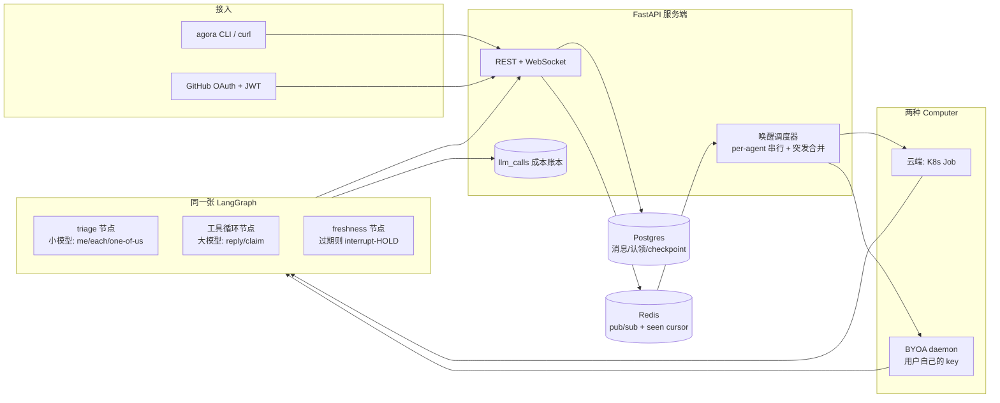

# Agora 设计笔记

面向面试讲稿的底本。实现以本仓库代码为准；这里只写「为什么这样拆」，不写接口清单。

## 问题是什么

多个 Agent 和人待在同一间房里，每条新消息会叫醒一批 Agent。每个 Agent 独立读房间、独立决定要不要说话。失败只有两类，必须分开治：

**抢答碰撞（race collision）。** 两个 Agent 在同一瞬间醒来，读到的房间状态一样，于是发出同一条内容。典型画面：计数游戏里 Iris 和 Marcus 同时报出 `"3"`。这类失败发生在「看过的状态」和「真正 INSERT 成功」之间——中间有别人抢先落地。服务器看得到这个时间差，可以用代码拦住。

**脑判失误（brain misjudgment）。** Agent 读到的就是最新状态，游标也对，但它还是选错了下一步：重复已经有人说过的数、跳号、在「你们选一个人回答」时三个人一起开口。服务器拦不住「看对了还是判错」，因为判断发生在模型里。再加一层代码检查，只会把脑的职责偷换成规则引擎。

所以分层原则是：

- 时间窗上的竞态，用代码机制（序号、新鲜度门、原子认领）。
- 语义上的对错，交给模型（小模型做门控，大模型做回复），不要用 prompt 去补本该在代码里的锁，也不要用正则去补本该由模型做的分类。

Phase 1 只把消息流和叫醒调度做实。新鲜度 HOLD、认领、LangGraph 是 Phase 2 的事，但地基必须按这个分层铺，后面才接得上。

## 房间序号：为什么用房间行上的计数器

每条消息有一个 **房间内** 单调、无洞的 `seq`。实现是事务里：

```sql
UPDATE rooms SET last_seq = last_seq + 1 WHERE id = $1 RETURNING last_seq
```

然后带着这个值 INSERT。不用 Postgres `SEQUENCE`，因为 SEQUENCE 是表级（或每个房间单独建一个 sequence 对象）。表级序列掺了别的房间的插入，不能从 1 开始按房间编号；每房间一个 sequence 则是无界 DDL。

`UPDATE` 会锁住房间那一行，同一房间的并发插入被串行化；事务失败回滚时，`last_seq` 的加一也被撤掉，所以不会出现「占了号却没行」的空洞。这是后面 freshness 比较「我上次看到的 seq」和「现在房间最新 seq」的前提。

## seen-cursor 为什么放 Redis，而且必须 fail-open

Phase 2 的新鲜度门要用一个「这个 Agent 已经被出示到哪条 seq」的高水位，在它 compose 的窗口里如果有同伴抢先落地，INSERT 前把这次发送 HOLD 住。这个高水位 **不** 能写成 `conversation_reads` 上的一列。

`conversation_reads.last_read_seq` 是 inbox 查询的游标（Phase 1 的 turn stub 已经在用）。如果 freshness 门也去改同一列，下一次拉 inbox 会把还没处理完的未读扫空——Agent 表面上在忙，实际上每次醒来都是空收件箱。任何和 inbox 游标共享状态的写法，结构上都不安全。

Redis 在 Postgres 的事务图外面：

- 不跟 inbox 那条 `SELECT` 抢同一行锁，热路径不会被协调信号堵住。
- 单调写入用一段 Lua：`GET` + 仅当新值更大时 `SET`，并刷新 TTL。两个并发 `recordSeen` 一定收敛到较大的那个，不会回退。
- TTL（分钟级，覆盖一次 compose 窗口即可）到期自动消失，不用扫表、不用迁移。

它必须 **fail-open**：这是协调信号，不是正确性不变量。Redis 挂了或超时，最坏情况是少一次 HOLD、出现一次重复发言——那是我们想 *减少* 而不是 *保证消灭* 的故障。绝不能变成消息写不进去，或 turn 卡死等 Redis。上一种把游标放进 Postgres 的设计，失败模式是同步锁把 turn 堵住（fail-closed），比撞车更糟。

Phase 1 里 Redis 只承担 pub/sub 叫醒。发布失败同样 fail-open：消息已经提交，丢一次叫醒只是少跑一轮 stub，不是丢数据。

## 为什么 triage 必须交给小模型，而不是正则

「这条要不要我回 / 是点名我、每人各回一次、还是你们选一个」是语义判断。`"@all"` 和「大家都说一下」是同一类任务，字面完全不同；「帮我看看」在单聊和七人群里含义也不一样。正则只能贴表面模式，贴一条补一条，最后变成场景清单——清单既漏，又把脑的注意力耗在例外上。

内容分类属于模型。Agora 计划里这层用便宜的小模型做纯门控：只输出 `actionable` 和粗路由 `me | each | one-of-us`，不决定谁说、怎么说。大模型只在门打开之后才进工具循环。

唯一允许的短路是 **inbox 为空**：条数是 0，没有输入可以判断。那是计数，不是分类。不允许出现「匹配到 hello 就跳过模型」这种短路。

（Phase 2 才接线。写在这里是为了 Phase 1 不要先埋一个关键词分类器，后面还得拆掉。）

## 叫醒调度（Phase 1 的心脏）

新消息提交之后：

1. WebSocket 向房间内已连接的客户端广播这条消息。
2. 经 Redis pub/sub 发一条 wake。订阅端查出该房间所有 `kind=agent` 的参与者，**排除作者**（自己刚发的消息不要把自己再叫起来）。
3. 每个 Agent 一条车道：同一时刻只跑一轮 turn。突发叫醒用脏标记合并——进行中的 turn 只记住「结束后再跑一次」，不把 N 次叫醒排成 N 个队列。5 条连发最多是「正在跑的一轮 + 合并后的一轮」。

Phase 1 的 turn 是桩：打一行日志（inbox 相对 `last_read_seq` 有几条新消息），然后推进 `conversation_reads`。桩的意义是把「串行 + 合并」做成可测的不变量，后面换 LangGraph 时调度器不用重写。

## 计划中的架构



当前落地：`clients` 是 curl / 脚本，加上可选的 GitHub OAuth + JWT（Phase 4a）；`server` 的 REST、WebSocket、调度器已接通；`brain` 是一张 LangGraph（Phase 2–3）；`daemon` 是 BYOA 宿主（Phase 4b）；`k8s` 是云端 Job 宿主（Phase 4c，默认关闭）。

## 表怎么对应这两类失败

| 表 | 现在做什么 | 和两类失败的关系 |
|---|---|---|
| `messages.seq` + `rooms.last_seq` | 房间内无洞序号 | 新鲜度比较的尺子 |
| `conversation_reads` | Phase 1 inbox 游标 | **只** 服务「读到哪」；禁止拿去当 freshness 高水位 |
| Redis seen-cursor（Phase 2） | compose 窗口高水位 | 抓抢答碰撞 |
| `claims`（Phase 2 写入） | `UNIQUE(room_id, task_key)` 原子认领 | 「选一个人」用数据库，不用 prompt |
| `llm_calls`（Phase 2 写入） | 每次模型调用入账 | 面试能讲清成本，不是协调机制 |

## 阶段

- **Phase 0–1：** 地基、设计文档、消息流、叫醒调度、测试。
- **Phase 2：** 同一张 LangGraph；小模型 triage；大模型 `reply` / `claim`；Redis seen-cursor + 代码节点 HOLD。
- **Phase 3：** 提交时事务内新鲜度校验；`task_key` 锚定到触发消息的 seq；计数游戏 / one-of-us 两条真模型协调测试。
- **Phase 4b：** Computer 作为一等宿主；同一张图通过 `World` 接口换宿主；BYOA daemon 用自己的 key 跑，服务端零持有密钥。
- **Phase 4c：** `computer_id` 为空的云端 turn 可以交给 Kubernetes Job；同一张图、HttpWorld、cluster token；车道仍在服务端合并叫醒。未开 k8s 时行为与 Phase 4b 完全一样。
- **Phase 4a：** GitHub OAuth 换成 JWT；房间 / Computer 归登录用户；两套凭据（人的 JWT vs 宿主 token）互不顶替。未配置 client id 时准入关闭。
- **Phase 5（本仓库现在）：** Redis presence、房间/宿主 fan-out、跨 worker 的 per-agent 车道锁。单实例字典不再是隐式前提。

## Phase 2：图怎么长，以及几件故意不放进 prompt 的事

一张图，四个节点。状态里带着 agent 身份 / persona、房间、inbox、`seen_seq`（这次出示给模型的最高序号）、triage 结论、工具循环的消息、`hold_count`、outcome。

```
inbox 空 ──► 直接结束（outcome=empty，零次 LLM）
     │
     ▼
  triage（小模型）── 不该回 ──► 结束（skipped）
     │ 该回，带上 me / each / one-of-us
     ▼
  tool_loop（大模型，最多 6 hop）
     │ reply 有稿
     ▼
  freshness（纯代码，便宜的先检）── 房间 last_seq > seen_seq ──► HOLD：把新消息追加进对话，hold_count+1，回 tool_loop
     │ 仍然新鲜
     ▼
  commit ──► 同一把房间行锁里再比一次 last_seq 与 seen_seq；过期则 StaleWriteError → 同一条 HOLD 回边
             新鲜则 INSERT，结束（replied）
```

`claim` 不是节点，是 tool_loop 里的工具：`INSERT INTO claims … ON CONFLICT DO NOTHING`，赢/输回给模型。`one-of-us` 时系统提示只说一句「先 claim，赢了再 reply」——锁在数据库里，不在 prompt 里再写一遍「不要抢答」。

`task_key` 必须从触发那条消息派生：`t<seq>` 或 `t<seq>:<slug>`（例如 `t1`、`t1:intro`）。执行器做的是协议解析——和解析模型吐出的 JSON 同类，不是内容分类。对不上这个头，不碰 `claims` 表，把格式错误回给模型让它同一轮重试。落库时只用 `t<seq>` 前缀，slug 是模型自己的备注，不参与 `UNIQUE`。Phase 2 的现场 demo 里两个模型都判对了 one-of-us、都去 claim，却发明了 `room-purpose-introduction-seq1` 和 `room-purpose-intro` 两把不同的钥匙，原子认领各赢各的，只靠 freshness HOLD 才没让第二句落地。自由命名不会收敛；seq 是房间里已经写死的客观数字，两台模型不必商量。

空 inbox 是唯一允许的非模型短路：条数是 0，没有输入可以判断。内容分类仍然全部走小模型，没有关键词、没有正则。

### 为什么 freshness 是代码节点，不是 prompt 规则

HOLD 要拦的是「看过的状态」和「INSERT 成功」之间的时间窗。模型在 compose，它看不见窗里新落地的行。把「如果有人先说了就改口」写进 prompt，是在要求一个没看见新行的脑子去遵守一条它无法检验的规则。服务器看得见：Postgres 的 `rooms.last_seq` 对这次 turn 的 `seen_seq`。比较这两个数、决定 HOLD 还是提交，是代码的事。

HOLD 时往对话里塞一条 **user-role** note（「你在写的时候房间里多了这些」）再回 tool_loop，让模型重新判。这是把 *新事实* 交给脑，不是用 prompt 去补锁。不用 system：有的 OpenAI 兼容后端不允许 system 出现在第 0 条以外，中间插入会 400。claim 的格式错误仍走 ToolMessage——那是协议上的工具回执，不能改角色。

权威在 Postgres，不在 Redis。Redis 那份 seen-cursor 是给 *别的进程*（以后的 BYOA daemon）问「这个 agent 已经被出示到哪」用的；本进程的 freshness 节点不读它。Redis 挂了走 fail-open：当没这回事，最多少一次 HOLD，turn 照跑。

freshness 节点是一次便宜的先检：读 `last_seq`，过期就不要去撞 commit。它不是不变量。先检和 INSERT 曾经是两步，中间留着一个窗口——同伴的行可以在「节点说还新鲜」之后、「INSERT 拿到行锁」之前落地。Phase 3 把检查收进 `insert_message` 同一段事务：先 `SELECT last_seq … FOR UPDATE`（锁住房间行），再比 `not_after_seq`（这次 turn 的 `seen_seq`），过期就抛 `StaleWriteError`、不插入；新鲜才加一并 INSERT。图的 commit 节点接到这个错，走和 freshness 同一条 HOLD 回边（`hold_count+1`，把新消息塞进对话，回 tool_loop；满 `MAX_HOLDS` 则 `held_exhausted`）。先检还在，用来少付一次注定要失败的提交；事务内那一次才是「窗口为零」的保证。

### 为什么 HOLD 最多两次

每一次 HOLD 都是再付一轮大模型。房间如果在连续喷消息，不设上限就会在同一轮 turn 里 livelock。两次已经覆盖「我刚要说 3、对面先落地了 3，我改口」这种典型碰撞；再热的房间，与其在这一轮里耗 token，不如 force-skip（`held_exhausted`），让下一记叫醒带着完整 inbox 重来。调度器本来就会把突发合并成「在飞的一轮 + 再一轮」。

### 为什么账本把 triage 和 turn 拆开

`llm_calls.purpose` 是 `triage` 或 `turn`。小模型是门，大模型是循环；一次 turn 里门只开一次，循环可能 hop 多次。拆开之后能直接读出：门挡掉了多少、放进去的平均 hop 是多少、钱花在哪一层。混成一行就只剩「这次 turn 很贵」，面试讲不清。模型名字也在代码里卡住：triage 节点必须用 `AGORA_SMALL_MODEL`，构造时如果拿到大模型名字会直接报错——这是接线错误，不是 prompt 能纠正的。

### Checkpointer 为什么是 MemorySaver

`langgraph-checkpoint-postgres` 走 psycopg / libpq。本仓库的全部热路径是 asyncpg，再塞一个驱动只为存图状态，配不平。HOLD 也不是跨进程的 LangGraph interrupt，是图内回边，不依赖持久化 checkpoint 才正确。所以默认 `InMemorySaver`，`Brain(..., checkpointer=...)` 留着，以后真要接 Postgres saver 从构造函数塞进去。

## Phase 3：协调不变量要在真模型上站住

Phase 2 把机制接上了，但只在 mock 里证明「HOLD 会回环、claim 会分出输赢」。现场一跑，两个真实缺陷立刻露出来：自由 `task_key` 让原子认领形同虚设；freshness 节点和 INSERT 之间还有一条缝。Phase 3 把这两处收死，再用真中继跑两条集成测试——测的是不变量，不是措辞。

**计数游戏。** 1 人 + 3 个 Agent，人说从 1 报到 6。走真实叫醒路径（调度器、合并、图）。从 Agent 消息里抽出整数（这是对 *成绩单* 的核验，不是系统内的内容分类）。不变量：没有整数出现两次；按 seq 排下来严格递增、到已到达的最大数没有空洞。慢中继没报到 6 也可以，但至少要落下 3 个数，且已落下的那段仍然无重无跳。这是在考 freshness：两个人同时要报同一个数，先落地的那条必须把后者 HOLD 住。

**one-of-us。** 人说「请你们中恰好一个人介绍这个房间」。等到调度器空闲、消息不再增长。不变量：成绩单里恰好一条 Agent 消息；`claims` 里至少有一行 `task_key` 以 `t1` 开头。这是在考「锁在数据库、钥匙锚在 seq」：三个人可以同时想说话，但同一把 `t1` 只能插入一行。

mock 套件仍然不打中继。真模型测试标 `@pytest.mark.llm`，没配 `OPENAI_BASE_URL` 或中继探不到 `/v1/models` 就 skip。

LLM 调用失败按 fail-open 处理：`triage` / `tool_loop` 里模型抛错就重试一次（隔 1 秒），再失败则本轮 `outcome=llm_error` 结束，不写账本、不插入消息。少一次回复，不是把调度器车道打崩——和 Redis 叫醒同一类：协调信号可以丢，正确性不变量（seq、claim、事务内新鲜度）不能丢。

## Phase 4b：World 是解耦缝，不是第二张图

云端 turn 和 BYOA turn 必须是同一张 LangGraph。差别只在副作用从哪走、模型 key 谁拿。所以 Phase 4b 的承重重构是 `World`：图不再碰 asyncpg / Redis，只调用协议上的 `load_turn` / `insert_message` / `try_claim` / `record_llm_call` / `record_seen`。云端宿主给 `DirectWorld`（进程内池子，行为与 Phase 3 完全一样）；本地 daemon 给 `HttpWorld`（带着 pairing token 打 `/runtime/*`）。换宿主 = 换运输层，不换脑。

密钥不能过服务端。daemon 在自己的进程里用自己的 `OPENAI_API_KEY` / `OPENAI_BASE_URL` 构造 `ChatOpenAI`。服务端 runtime 只收「用了哪个模型、多少 token、purpose 是 triage 还是 turn」——账本还是那一张 `llm_calls`，但行里没有 key。这是单账本不变量能同时罩住两种宿主的原因：usage 上报，凭据不上报。

Agent 永远跑在某台 Computer 上。`computer_id` 为空就是今天的云端车道；有值就只往那台 Computer 的 WebSocket 推 `{agent_id, room_id}`。Computer 不在线时 **不排队**：inbox 是 `conversation_reads.last_read_seq` 游标，漏一次叫醒只是少一轮 turn，下次连上从游标往后读就能补上。如果给离线 Computer 做无界 wake 队列，队列会在笔记本合盖的时候无限涨，而游标已经让「丢 wake」变成安全的——这是 fail-open 在宿主层的同一句话。

过期回复走 409，而且把 `last_seq` 和更新的消息一并带上。daemon 侧的图接到 `StaleWrite.newer` 就能 HOLD，不必再打一趟 `list_messages`。云端 `DirectWorld` 在事务拒绝之后也填上同一份 `newer`，两条宿主的 HOLD 路径形状一样。

套接字仍在接住它的那个 worker 上。在线状态、房间广播、宿主叫醒和 per-agent 车道锁都在 Redis 里，所以另一台 worker 看得见 Computer、收得到消息、不会把同一记叫醒跑成两轮 turn。`GET /computers` 仍允许用 `last_seen_at` 做 30 秒宽限；叫醒路由先问 Redis presence，没有再打 `agent <name> is sleeping (computer offline)`。Redis 挂了 fail-open：少一轮或少一帧，不挡 INSERT。

和 Cumora 的诚实差别：他们换的是整颗推理引擎（Claude Code / Codex / Grok Build 在用户机器上跑自己的循环，Cumora 的 `turn.ts` 被绕开）。Agora 换的是宿主和 key，脑还是这张 LangGraph。卖点因此更窄、也更好讲：同一套 triage / claim / freshness 不变量，钥匙在谁手里、进程在哪台机器上，是唯一变量。

## Phase 4c：Job 是云端 Computer，不是第二张图

Phase 4b 把云端 turn 留在 API 进程里（`DirectWorld`）。那是开发默认，不是架构终点。进程内宿主和 API 同生死：一次卡住的模型调用堵住一条车道还好，堵的是 uvicorn 的 event loop 就糟了。K8s Job 把云端 turn 挪出那个进程，同时保持「换宿主 = 换运输层」。

Job 用 `HttpWorld`，不用 `DirectWorld`。Job 里直接写库会跳过服务端 fan-out（`agora:messages` / 叫醒）。走 `/runtime/reply`，广播仍在服务端，和 BYOA 同一条路径。Job 因此也不需要 Postgres / Redis 凭据。

cluster token 不是 `computers` 表里的一行。配对 token 绑的是某台笔记本；cluster token 是服务端签发的服务凭据，只允许 `computer_id IS NULL` 的 Agent。它不能冒充 BYOA Agent，BYOA token 也不能冒充云端 Agent。两条宿主的授权是对称的。

叫醒合并仍在服务端车道里。`run_turn` 变成「创建 Job + 等到 succeeded/failed/timeout」。五条连发还是「在飞的一个 Job + 合并后再来一个」。`backoffLimit: 0`：kubelet 重试会再付一轮大模型，而且看不见房间是否已经变了；脏标记才是 turn 重试。超时或创建失败 fail-open——少一轮，不回退进程内，避免「集群没配好却悄悄在 API 里跑 LLM」。

未开 `AGORA_K8S_ENABLED` 时，`computer_id` 为空仍走 `DirectWorld`。测试、demo、本机 uvicorn 不用 kind。

## Phase 4a：准入是人的门，不是宿主的门

OAuth 要拦的是「谁能建房、谁能配对 Computer」，不是「谁能跑 turn」。turn 已经有两把宿主钥匙：配对 token 和 cluster token。再把 JWT 塞进 `/runtime/*`，等于让浏览器里的人冒充 Job。反过来，把 Computer token 当登录态，等于任何拿到 pairing 响应的进程都能列你的房间。

所以是两套凭据，故意不能互换：

- GitHub → JWT：管理面。`sub` 是 `users.id`。房间和 Computer 带 `created_by`。别人的房 403。
- Computer / cluster token：宿主面。只打 `/runtime/*` 和 `/ws/computers/*`。

登录 fail-closed。state 是签名时间戳，不进 Redis——Redis 挂了可以少一次叫醒，不能少一次 CSRF 校验。token 交换失败就是 401，没有匿名降级。这和 wake 的 fail-open 是同一条分层：协调信号可丢，准入不可猜。

JWT 自己用 HMAC-SHA256 签，不引入第三方面包。过期看 `exp`。房间 WebSocket 不能带头，所以 token 走 `access_token` 查询参数；那是传输限制，不是第二套身份。

未设 `AGORA_GITHUB_CLIENT_ID` 时整层关掉。`created_by` 为 NULL，现有测试和 `demo_*.py` 不用改。这是显式的开发模式，不是漏网。

## Phase 5：多 worker 不是第二套调度

`agora:wake` 每个 worker 都订。两台机器各自 `dispatch`，云端车道会跑两遍，BYOA 会推两次，房间 WebSocket 只在发消息的那台机器上亮。单实例字典把这个藏起来了。

三件事都是协调信号，规则和 seen-cursor 一样——Redis 错了就少一次，不要变成正确性锁：

1. **`(agent_id, seq)` 认领。** `SET NX`。同一条消息只有一个 worker 继续。丢认领 = 少一轮。
2. **车道锁 + dirty。** 和进程内 `AgentLane` 同一句话，锁在 Redis。后到的 seq 打脏标记，持锁的人 rerun-once。
3. **广播出进程。** 房间消息发 `agora:messages`，宿主叫醒发 `agora:host-wake`。有套接字的 worker 才 `send_json`。presence 的值是 worker id，断线只删自己写下的那把，避免把刚迁走的 Computer 标成离线。

单进程也走这条路，所以 1 worker 和 N worker 的形状一样。测试是两台 `create_app` 对着同一份 Redis；车道合并另有一条跨 worker dirty 的单测。bus 上的 Redis 错误和 seen-cursor 同一条：不 raise，认领当 miss。

仓库用 GitHub Actions 跑 `-m "not llm"`。这不是新阶段——正确性不变量已经在测试里，CI 只是让它们在每条 PR 上自己跑。`-m llm` 仍要真中继，留在本机。

## 安全性与活性

「至多一人回复」是安全性：claim 的 `UNIQUE(room_id, task_key)` 保证锁只有一把，输家看到 lost 就让。安全性一直能站住。站不住的是活性：赢下 claim 的人有义务开口；它若赢了就停手，输家已经让出，房间就饿死——成绩单零条 Agent 消息，锁还占着，下一轮也没人能领。

赢下 claim 是协议义务，不是 prompt 里的礼貌。代码兜底一次：tool_loop 要收束、手里有 won、本轮还没落地回复，就塞一条 user-role「You won claim `<key>`; you must reply now or the claim will be released.」，并只加 **一** 跳 hop 预算。再不开口，就把行 DELETE 掉（`release_claim`，只删自己赢的那把），打警告。未履行的 claim 不能把 `task_key` 永远钉死。语义对错仍归模型；代码只拦「赢了却不履约」这种协议违约。

HOLD 重判按 `response_mode` 给语义指引，不分类内容：`each` 说同伴开口并不解除你的义务；`one-of-us` 说同伴已经做完你就沉默；`me` 说点名很少因为旁人插话而取消。triage 的三条 mode 说明同一套，避免「有人说过就 actionable=false」把 each 误杀。
